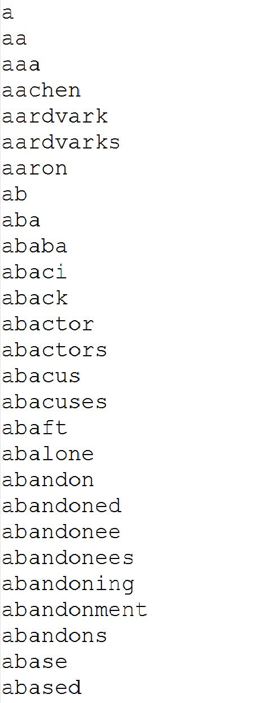
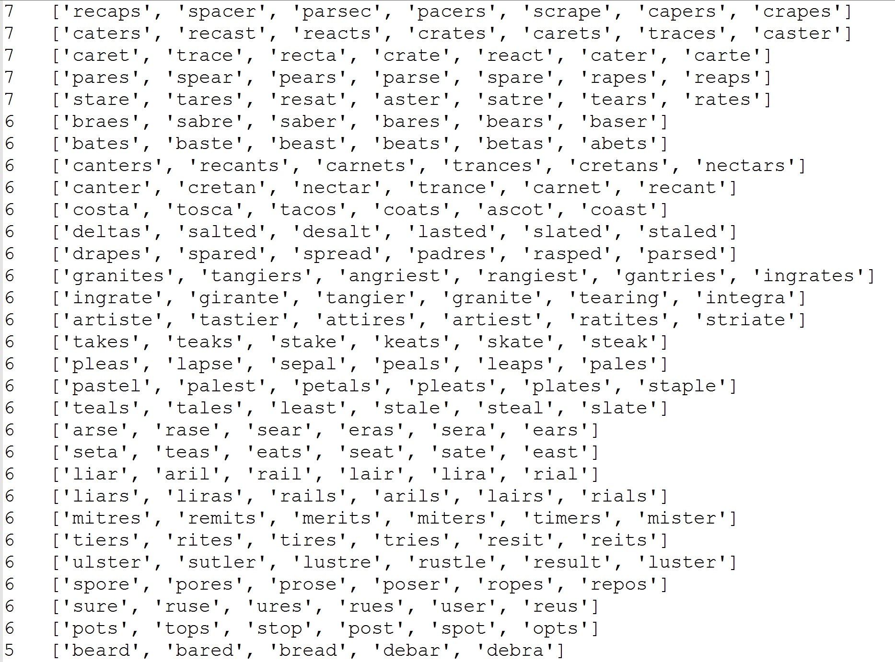
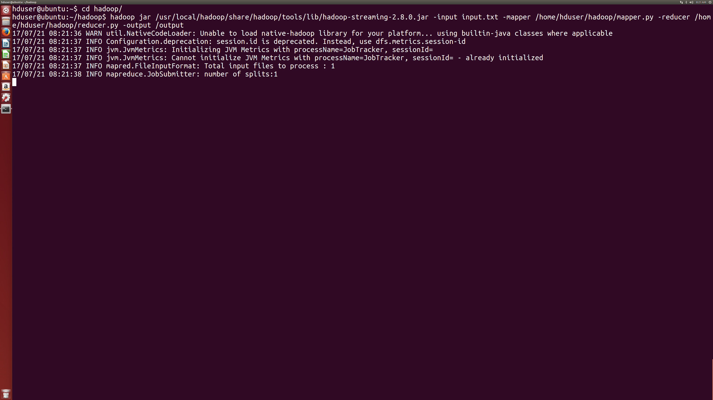
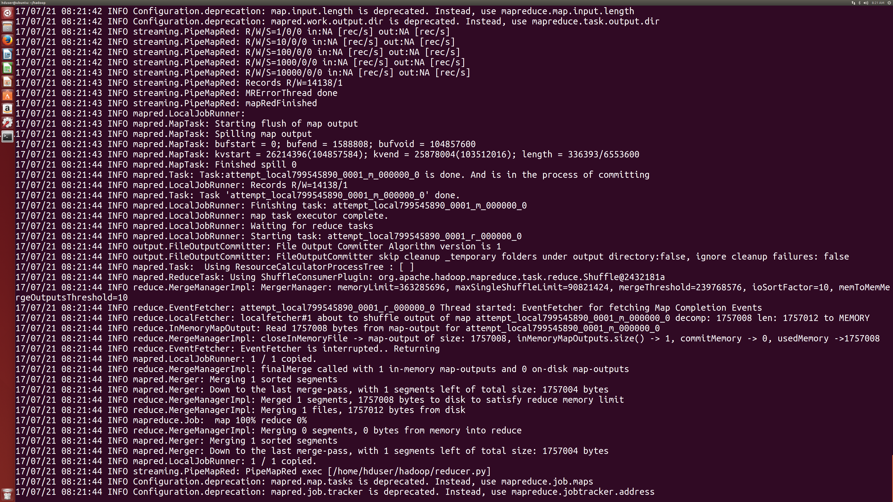
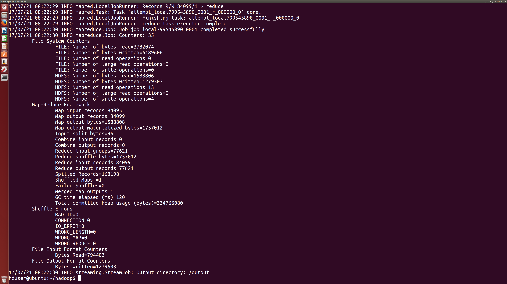

<div align="center">

</div>
# Anagram Sorter (Python + Hadoop)
### Sharif University Of Technology
### Green Computing Final Project Spring 2017
<hr/>
<div align="center">
<a href="https://scrutinizer-ci.com/g/sepandhaghighi/hadoop/"></a>
<a href="https://www.codacy.com/app/sepand-haghighi/hadoop?utm_source=github.com&amp;utm_medium=referral&amp;utm_content=sepandhaghighi/hadoop&amp;utm_campaign=Badge_Grade"></a>
<a href="https://scrutinizer-ci.com/g/sepandhaghighi/hadoop/"></a>
<a href="https://www.python.org/ftp/python/2.7.13/python-2.7.13.msi"></a>
</div>					

## Requirements


- [Python 2.7+](https://www.python.org/ftp/python/2.7.13/python-2.7.13.msi "Python 2.7+")
- [Hadoop Framework](http://hadoop.apache.org/ "Hadoop")
- [JDK 7+](www.oracle.com/technetwork/java/javase/downloads/index.html "JDK 7+")
- SSH
- Git	

## Install Hadoop							


1. Install Java
	- ```sudo apt-get update```
	- ```sudo apt-get install default-jdk```
2. 	Add User
	- ```sudo addgroup hadoop```
	- ```sudo adduser --ingroup hadoop username```
	- ```sudo adduser username sudo```
3. Install And Config SSH
	- ```sudo apt-get install ssh```
	- ```su username```
	- ``` ssh-keygen -t rsa -P ""```
	- ``` cat $HOME/.ssh/id_rsa.pub >> $HOME/.ssh/authorized_keys```
4. Install Hadoop
	- [http://hadoop.apache.org/releases.html](http://hadoop.apache.org/releases.html "Hadoop Download Page")
	- Extract File (without Error !!)
	- ```sudo mv * /usr/local/hadoop```
	- ```sudo chmod -R 777 /usr/local/hadoop```
5. Setup Configuration Files
	- ```update-alternatives --config java```
	- ```nano ~/.bashrc``` and append this items
		- ```export JAVA_HOME=/usr/lib/jvm/java-7-openjdk-amd64```
		- ```export HADOOP_INSTALL=/usr/local/hadoop```
		- ```export PATH=$PATH:$HADOOP_INSTALL/bin```
		- ```export PATH=$PATH:$HADOOP_INSTALL/sbin```
		- ```export HADOOP_MAPRED_HOME=$HADOOP_INSTALL```
		- ```export HADOOP_COMMON_HOME=$HADOOP_INSTALL```
		- ```export HADOOP_HDFS_HOME=$HADOOP_INSTALL```
		- ```export YARN_HOME=$HADOOP_INSTALL```
		- ```export HADOOP_COMMON_LIB_NATIVE_DIR=$HADOOP_INSTALL/lib/native```
		- ```export HADOOP_OPTS="-Djava.library.path=$HADOOP_INSTALL/lib" ``` and save file
	- ```source ~/.bashrc```
	- ``` nano /usr/local/hadoop/etc/hadoop/hadoop-env.sh``` append this line
		- ```export JAVA_HOME=/usr/lib/jvm/java-7-openjdk-amd64```
	- ``` sudo mkdir -p /app/hadoop/tmp```
	- ``` sudo chown username:hadoop /app/hadoop/tmp```
	- ``` nano /usr/local/hadoop/etc/hadoop/core-site.xml``` enter the following in between the <configuration></configuration> tag
		- ``` <configuration>
 				<property>
  				<name>hadoop.tmp.dir</name>
  				<value>/app/hadoop/tmp</value>
  				<description>A base for other temporary directories.</description>
 				</property>

 				<property>
  				<name>fs.default.name</name>
  				<value>hdfs://localhost:54310</value>
  				<description>The name of the default file system.  A URI whose
  				scheme and authority determine the FileSystem implementation.  The
  				uri's scheme determines the config property (fs.SCHEME.impl) naming
  				the FileSystem implementation class.  The uri's authority is used to
  				determine the host, port, etc. for a filesystem.</description>
 				</property>
				</configuration> ```
	- ```cp /usr/local/hadoop/etc/hadoop/mapred-site.xml.template /usr/local/hadoop/etc/hadoop/mapred-site.xml```
	- ``` nano /usr/local/hadoop/etc/hadoop/mapred-site.xml``` enter the following in between the <configuration></configuration> tag
		- ```<configuration>
 			<property>
  			<name>mapred.job.tracker</name>
  			<value>localhost:54311</value>
  			<description>The host and port that the MapReduce job tracker runs
  			at.  If "local", then jobs are run in-process as a single map
  			and reduce task.
  			</description>
 			</property>
			</configuration> ```
	- ```sudo mkdir -p /usr/local/hadoop_store/hdfs/namenode```
	- ```sudo mkdir -p /usr/local/hadoop_store/hdfs/datanode```
	- ```sudo chown -R username:hadoop /usr/local/hadoop_store```
	- ```nano /usr/local/hadoop/etc/hadoop/hdfs-site.xml``` enter the following in between the <configuration></configuration> tag
		- ```<configuration>
 			<property>
  			<name>dfs.replication</name>
  			<value>1</value>
  			<description>Default block replication.
  			The actual number of replications can be specified when the file is created.
  			The default is used if replication is not specified in create time.
  			</description>
 			</property>
 			<property>
   			<name>dfs.namenode.name.dir</name>
   			<value>file:/usr/local/hadoop_store/hdfs/namenode</value>
 			</property>
 			<property>
   			<name>dfs.datanode.data.dir</name>
   			<value>file:/usr/local/hadoop_store/hdfs/datanode</value>
 			</property>
			</configuration>```
6. Start Hadoop
	- ```hadoop namenode -format```
	- ```cd /usr/local/hadoop/sbin```
	- ```start-all.sh```
	- In Connection Refused Problems Check [https://wiki.apache.org/hadoop/ConnectionRefused](https://wiki.apache.org/hadoop/ConnectionRefused "Connection Refused")


## Clone Repo			
- ```cd /home/username```
- ```git clone https://github.com/sepandhaghighi/hadoop```
- ``` chmod -R 777 /home/username/hadoop```

## HDFS Commands
	
1. Add input to filesystem --> 	``` hadoop fs -put inputfile inputfile```
2. Read output file --> ``` hadoop fs -cat /output/part-00000``` 
3. Copy output file --> ``` hadoop fs -get /output/part-00000 /home/username/hadoop/output.txt```
4. Remove output folder --> ``` hadoop fs -rmr /output/```  		


## Run Map/Reduce
``` hadoop jar /usr/local/hadoop/share/hadoop/tools/lib/hadoop-streaming-2.8.0.jar -input input.txt -mapper /home/hduser/hadoop/mapper.py -reducer /home/hduser/hadoop/reducer.py -output /output```


## Samples & Screenshots

[Download Run Full Video 43MB](http://www.shaghighi.ir/hadoop/Full.mkv "Download")			

Input.txt and output.txt in data folder

<div align="center">

<p>Input file</p>

<p>Output file</p>

<p>Screenshot 1</p>

<p>Screenshot 2</p>

<p>Screenshot 3</p>
</div>


				


